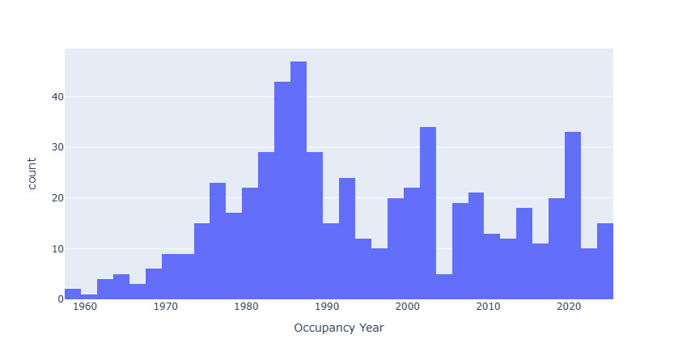
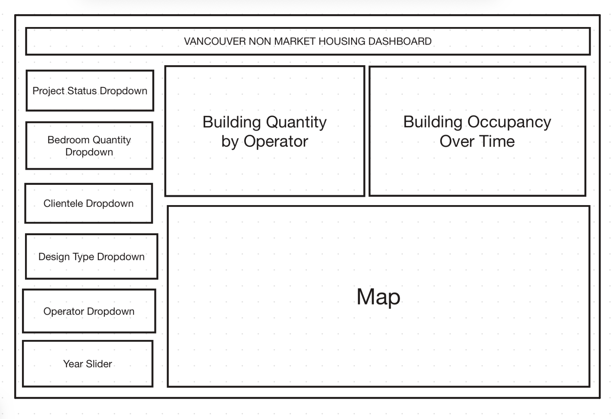

## Section 1: Motivation and Purpose

> **Our role:** Data Analytics and Reporting Team for City of Vancouver
>
> **Target audience:** Vancouver residents seeking to explore and better understand affordable housing options
>
> Rising housing costs remain a significant and ongoing challenge in Vancouver. Non-market housing offers critical affordable alternatives for residents, yet the overall landscape of these options is not clearly organized or easily accessible. This dashboard aims to close that gap by delivering clear, structured insights into non-market housing across the city — including building types, management models, resident demographics, unit composition, and neighbourhood distribution.

## Section 2: Description of the Data

> The Non-Market Housing dataset contains 641 records, with each row representing one housing project (building). The columns describe the following key characteristics, which we will embed in our dashboard to reveal meaningful insights:
>
> - **Address & Geographic Coordinates**  
>   Each project includes a physical address and spatial coordinates (`Geom`), enabling neighbourhood-level analysis and interactive map visualizations.
>
> - **Project Status & Occupancy Year**  
>   Indicates whether a project is completed, proposed, approved, or under construction, along with the occupancy year where available. This allows users to explore housing development over time.
>
> - **Operator / Management Organization**  
>   Identifies the organization responsible for managing the building (e.g., co-op housing associations, non-profit providers, public operators), enabling comparisons across management models.
>
> - **Clientele Groups (Demographics)**  
>   Unit counts are categorized by target populations — Families, Seniors, and Other groups. This serves as a proxy for understanding who the housing is intended to support.
>
> - **Unit Design & Bedroom Composition (Proxy for Apartment Size)**  
>   Units are further broken down by:
>   - **Accessibility Type**: Accessible, Adaptable, and Standard  
>   - **Bedroom Count**: Studio, 1BR, 2BR, 3BR, 4BR, and Room  
>
>   This detailed structure allows us to analyze apartment size distribution and accessibility features across projects.
>
> Together, these attributes provide a comprehensive view of Vancouver’s non-market housing landscape, supporting analysis by geography, operator type, target population, and unit composition.

## Section 3: Research Questions & Usage Scenarios

### Usage Scenario

> Imagine you graduated from the Masters of Data Science from UBC 3 years ago. You work hard as a Data Scientist, and you have a loving partner. So you are thinking "I would > love to marry her, but first I need to secure housing to provide the stable life she deserves" 
> 
> But, when you look at the Housing Market, everything in Vancouver is WAYYYY tooo expensive, and now you started looking at 1 bedroom in Langley. Damnnnn! 
> 
> A secret voice: "Hey, Have you heard of Co-op Housing? If you lucky enough to get one, its basically like winning the lottery!" 
> 
> Now, you are trying to know more about Co-op Housing, aiming to develop an overview, and you tumbled upon the City of Vancouver Website. 

### User Stories
*You can choose to frame your detailed requirements as User Stories...*

> **User Story 1:**  
> As an **aspiring homeowner**, I want to **know how many Co-op housing projects were built and completed in the past few years**, as this will **help me understand the supply of this type of housing**. If the government has ramped up production in recent years, I might actually have a chance of securing one.
>
> **User Story 2:**  
> As a **young adult looking to start a family**, I want to understand **who my future neighbours might be**. Are they **young families or seniors**? I would love to be able to filter buildings, as a building targeting young families would fit me better.
>
> **User Story 3:**  
> As a **stressed-out home buyer**, I want a quick overview of **all the locations available to me**. A map that shows all building locations and neighbourhoods would be awesome! I could then filter buildings and identify locations more precisely.

## Section 4: Exploratory Data Analysis

> **User Story 1: Understand supply of housing**
> 
> The graph shows that the number of projects built over time has been declining. This might explain why it is difficult to find housing.

## Section 5: App Sketch & Description

> The dashboard interface is designed to minimize unnecessary clicks and present key insights at a glance. On the left side are all filter controls (dropdowns and sliders), which will dynamically update the three main visualizations. Users can combine filters to explore specific housing types, operators, demographics, and time ranges.

> The **top-left chart** displays building volume by a selected dimension (subject to refinement). For example, it may show building counts by Project Status or by Operator Management Group, allowing users to understand which operators manage the largest share of non-market housing.

> The **top-right chart** shows building volume over time. This helps users understand trends in housing supply, including whether certain types of non-market housing have increased in recent years.

> The **center visualization** is an interactive map for spatial exploration. It allows users to quickly identify the geographic distribution of non-market housing projects, view their locations across neighbourhoods, and filter buildings to pinpoint specific areas of interest.
