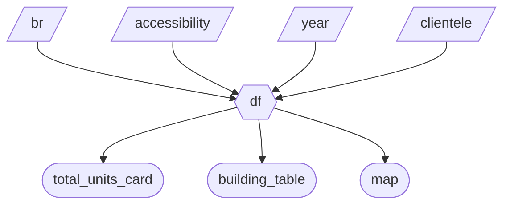

# Milestone 2 – Dashboard Prototype Specification

## 1. Updated Job Stories

| # | Job Story | Status | Notes |
|---|-----------|--------|-------|
| 1 | When I explore housing, I want to filter by occupancy year so I can limit my search to new developments. | Implemented | Completed in Milestone 2 - Changed from understanding supply over time to filtering because home buyers would be interested in specific projects rather than trend |
| 2 | When I want to explore projects for a specific client type, I want to filter by clientele type so I can focus on relevant buildings. | Implemented | As per milestone 1 |
| 3 | When I want to explore filtered data geographically, I want to see building locations on a map so I can understand spatial distribution. | Implemented | As per milestone 1 |
| 4 | When I am exploring affordable housing projects, I want to filter by bedroom count and building type so I can focus on relevant developments. | Implemented | Completed in Milestone 2 - Added story that was planned but not written |
| 5 | When I select filters, I want to see a summary metric so I can quickly understand total matching buildings. | Implemented | Completed in Milestone 2 - Added to give a quick sense of total supply |
| 6 | When I explore filtered data, I want to see building-level details in a table so I can inspect specific projects. | Implemented | Completed in Milestone 2 - Changed from bar chart to table because home buyers would be interested in specific projects rather than aggregates |
| 7 | I love the dashboard, I wish I can export the data to share it with people who are interested in it. | Implemented | Completed in Milestone 3 - Download Data Capability and the AI Chat box ability to do SQL filtering |
| 8 | When downloading the data, I wnat to see some quick summaries, like building age, and how many rows of data will I get. | Implemented | Completed in Milestone 3 - Total Units + Average Building Age Card under tab AI Explorer |
| 9 | I want to be able to filter out the area regardless of knowing the neighbourhood name. I wish I can just click the map to filter! | Implemented | Completed in Milestone 4 - Our lasso/box selection tool advance feature |

---

## 2. Component Inventory

| ID | Type | Shiny Widget / Renderer | Depends On | Job Story |
|----|------|------------------------|------------|------------|
| year | Input | `ui.input_slider()` | — | #1 |
| clientele | Input | `ui.input_checkbox_group()` | — | #2 |
| br | Input | `ui.input_selectize()` | — | #4 |
| accessibility | Input | `ui.input_selectize()` | — | #4 |
| df | Reactive calc | `@reactive.calc` | `year`, `clientele`, `br`, `accessibility` | #1, #2, #3, #4, #5, #6 |
| total_units_card | Output | `ui.output_text()` | df | #5 |
| building_table | Output | `ui.output_table()` | df | #6 |
| map | Output | `@render.plotly()` | df | #3 |
| reset | Input | `ui.input_action_button()`| —  | #1, #2, #4, #9 |
| map_selected_indices | Reactive state | `reactive.value()`  | `map`  | #9 |
| df_map_selected | Reactive calc  | `@reactive.calc`   | `df`, `map_selected_indices` | #5, #6, #9  |
| df_points  | Reactive calc  | `@reactive.calc`     | `df`  | #3, #9   |
| ai_title | Output  | `ui.output_text()`| `qc_vals`    | #7             |
| ai_total_units | Output | `ui.output_text()`   | `qc_vals.df()`   | #7, #8  |
| ai_avg_age  | Output | `ui.output_text()`  | `qc_vals.df()`    | #7 , #8           |
| ai_data_table   | Output | `ui.output_data_frame()` / `@render.data_frame` | `qc_vals.df()`   | #7, #8  |
| download_data   | Download | `ui.download_button()` / `@render.download`     | `qc_vals.df()`   | #7     |

**Notes:**

- `df` is the main reactive calculation that filters the dataset based on all selected inputs.  
- All outputs depend on `df`, ensuring efficient reactivity (one calculation triggers all relevant outputs).  

---

## 3. Reactivity Diagram

## 4. Calculation Details

### 4.1 `df`
- **Depends on:** 
  - `br`
  - `accessibility`
  - `year`
  - `clientele`
- **Performs:** 
  - Filters the dataset to include only rows matching the selected bedroom count, building design type, occupancy year range, and client type. 
- **Consumed by:** 
  - `total_units_card`
  - `building_table`
  - `map`

### 4.2 `total_units_card`
- **Depends on:** `df`  
- **Performs:** Counts the number of units in the filtered dataset.  
- **Displayed as:** KPI summary card showing “Total Units”.

### 4.3 `building_table`
- **Depends on:** `df`  
- **Performs:** Selects and formats columns: Building Index, Building Name, Occupancy Year.  
- **Displayed as:** Interactive table for building-level exploration.

### 4.4 `map`
- **Depends on:** `df`  
- **Performs:** Plots building locations on a map using latitude/longitude.  
- **Displayed as:** Interactive map showing spatial distribution of filtered buildings.

## Complexity Enhancement

1. Added reset button to reset filters back to default. If users want to reset to default filters, they do not have to individually remove filters.

2. Added AI Chat box. Not only making the dashboard more fancy, but people can directly filter the data without spending too much time understanding the columns. 

3. Added data download capability. Sharing is caring, and the ability to download data and share is loving. 

4. Added lasso/box selection tool. You see, you click, you filter - it's that simple. 

