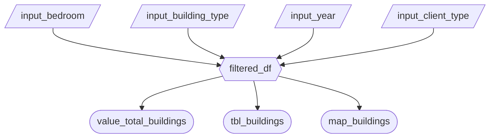

# Milestone 2 – Dashboard Prototype Specification

## 1. Updated Job Stories

| # | Job Story | Status | Notes |
|---|-----------|--------|-------|
| 1 | When I am exploring affordable housing projects, I want to filter by bedroom count and building type so I can focus on relevant developments. | Implemented | Filters added in sidebar |
| 2 | When I select filters, I want to see a summary metric so I can quickly understand total matching buildings. | Implemented | Value card shows count |
| 3 | When I explore filtered data, I want to see building-level details in a table so I can inspect specific projects. | Implemented | Table added |
| 4 | When I want to explore projects for a specific client type, I want to filter by clientele type so I can focus on relevant buildings. | Implemented | Added `input_client_type` |
| 5 | When I want to explore filtered data geographically, I want to see building locations on a map so I can understand spatial distribution. | Pending M3 | Map enhancements planned |
| 6 | When I explore filtered data over time, I want to filter by occupancy year so I can see trends in new developments. | Implemented | Added `input_year` slider |

---

## 2. Component Inventory

| ID | Type | Shiny Widget / Renderer | Depends On | Job Story |
|----|------|------------------------|------------|------------|
| input_bedroom | Input | `ui.input_select()` | — | #1 |
| input_building_type | Input | `ui.input_select()` | — | #1 |
| input_year | Input | `ui.input_slider()` | — | #6 |
| input_client_type | Input | `ui.input_select()` | — | #4 |
| filtered_df | Reactive calc | `@reactive.calc` | input_bedroom, input_building_type, input_year, input_client_type | #1, #2, #3, #4, #6 |
| value_total_buildings | Output | `ui.value_box()` | filtered_df | #2 |
| tbl_buildings | Output | `@render.data_frame` | filtered_df | #3 |
| map_buildings | Output | `@render.plot()` / `@render.map()` | filtered_df | #5 |

**Notes:**

- `filtered_df` is the main reactive calculation that filters the dataset based on all selected inputs.  
- All outputs depend on `filtered_df`, ensuring efficient reactivity (one calculation triggers all relevant outputs).  

---

## 3. Reactivity Diagram

## 4. Calculation Details

### 4.1 `filtered_df`
- **Depends on:** 
  - `input_bedroom`
  - `input_building_type`
  - `input_year`
  - `input_client_type`
- **Performs:** 
  - Filters the dataset to include only rows matching the selected bedroom count, building design type, occupancy year range, and client type. 
- **Consumed by:** 
  - `value_total_buildings`
  - `tbl_buildings`
  - `map_buildings`

### 4.2 `value_total_buildings`
- **Depends on:** `filtered_df`  
- **Performs:** Counts the number of buildings in the filtered dataset.  
- **Displayed as:** KPI summary card showing “Total Buildings”.

### 4.3 `tbl_buildings`
- **Depends on:** `filtered_df`  
- **Performs:** Selects and formats columns: Building Index, Building Name, Occupancy Year.  
- **Displayed as:** Interactive table for building-level exploration.

### 4.4 `map_buildings`
- **Depends on:** `filtered_df`  
- **Performs:** Plots building locations on a map using latitude/longitude.  
- **Displayed as:** Interactive map showing spatial distribution of filtered buildings.